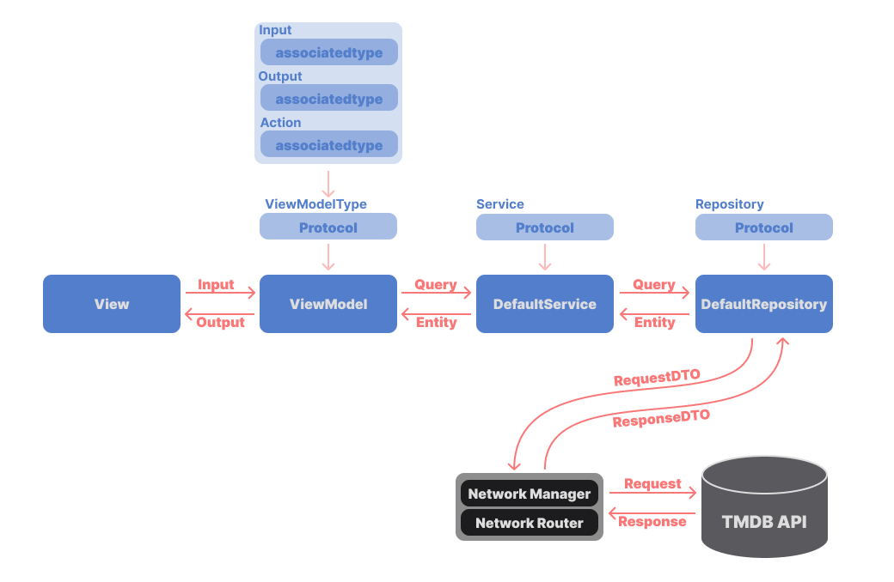

# 🎬 Film-in

<br>
<div align=center>
    
    
    
</div>
<br>
<p align="center">
     
</p>

<p align="center"> 
    
     
     
     
       
</p>
<br>

# 앱 한 줄 소개
> 🎬 본 영화 및 볼 예정인 영화를 간단하게 저장하는 앱, 근데 이제 알림을 곁들인. ([Appstore](https://apps.apple.com/kr/app/film-in/id6736368535))

<br>

# 주요기능
- 사용자의 선호 장르에 대한 맞춤 영화 추천
- 최근 인기 작품, 현재 상영작, 개봉 예정작 확인
- 배우 / 제작진 상세 정보 확인
- 관람 예정 영화에 대해 `알림 설정`을 통해 `Local Notification`을 활용한 `푸시 알림 기능` 제공
- Realm DB를 활용하여 저장된 '본 영화'와 '볼 영화'를 사용자가 `설정한 날짜`에 따라 `필터링`하고, 이를 날짜별로 조회
- 다국어 지원
    - 이 앱은 한국어, 영어, 일본어를 지원하며, 모든 주요 텍스트 및 영화 정보가 각 언어로 번역되어 있음.
    - 사용자의 설정된 국가에 맞게 언어가 번역되어 출력됨.

<br>

# 프로젝트 환경
- 인원
  - iOS 1명
- 기간
  - 2024.09.12 - 2024.10.01 (약 19일)
- 버전
  -  iOS 16.4 +

<br>

# 프로젝트 기술스택
- 활용기술
  - SwiftUI, Combine, Swift Concurrency
  - MVVM, Input-Output, Clean Architecture
- 라이브러리

|라이브러리|사용목적|
|-|-|
|Realm|Local DB 구축|
|Moya|추상화된 네트워크 통신 활용|
|PopupView|간편한 팝업 UI 구성|
|Kingfisher|이미지 로드 및 캐싱 처리|
|YouTubePlayerKit|간편한 YouTube Player UI 구성|
|Firebase Crashlytics|앱 안정성 개선|
<br>

# 앱 아키텍쳐
<p align="center"> 
     
</p>

> MVVM(Input/Output) + Clean Architecture
- Input/Output 패턴을 활용하여 단방향 데이터바인딩
- ViewModel, Service, Repository 로 나눠지는 역할에 따른 로직 모듈화
- Router 패턴을 활용하여 반복되는 네트워크 작업을 추상화
- DIP(의존성 역전 원칙)을 준수
  - 추상화된 Protocol을 채택하여 객체의 생성과 사용을 분리
  - 이를 통하여 하위모듈에서 구현체가 아닌 추상화된 타입에 의존 

<br>

# 트러블 슈팅

### Memory Leak

<details>
<summary>init이 된 후 deinit이 되지 않는 이슈</summary>
<div>

<br>
1️⃣ 메모리가 줄어들지는 않고 쌓이기만 하는 이유
<br>

계속해서 init만 일어날 뿐, deinit이 호출되지 않는 현상을 발견

<p align="center"> 
     
</p>

<br>
앱을 트래킹한 결과 메모리 Leak이 일어나고 있음을 확인

<p align="center"> 
     
</p>

<br>
상황을 생각해 봤을 때 View에서 일어나는 Action이
<br>
View가 Appear 되는 시점에 viewModel에 task가 되었라는 Action을 취하고
```swift
.task {
    viewModel.action(.viewOnTask)
}
```
<br>

구독을 통해 영화 상세 정보를 Fetch 해오게 된다.
```swift
input.viewOnTask
    .sink {
        Task { [weak self] in
            guard let self else { return }
            await fetchMovieInfo()
        }
    }
    .store(in: &cancellable)
```
<br>

코드 상에서 강제적으로 구독을 해지시킨다면 어떻게 될까?
```swift
input.viewOnTask
    .sink {
        Task { [weak self] in
            guard let self else { return }
            await fetchMovieInfo()
        }
    }
    .cancel()
```
<br>

위에서 계속 init만 일어나던 객체들이
<br>
구독을 강제적으로 `cancel()`을 통해 해제 해준 결과
<br>
deinit이 잘 호출되는 것을 확인할 수 있다.

<p align="center"> 
     
</p>

여기까지 확인해 봤을 때
<br>
객체들의 deinit이 일어나지 않은 이유는
<br>
구독이 해제가 되지 않기 때문이며
<br>
그로 인해 메모리 누수가 일어나고 있다고 판단이 되었다.
<br>
그렇지만 바로 `cancel()`을 통해 해제해 버리는 경우
<br>
event를 방출하자마자 바로 구독이 해제가 되어버리는 것 같다.
<br>
그렇게 생각한 이유는 `sink { }` 내부 코드가 작동이 되지 않기 때문이다.

<p align="center"> 
     
</p>

<br>
해결해야 하는 문제는 두 가지
1. 구독 후 `sink { }`내부에서 비동기로 API를 호출할 경우 해지가 되지 않는 현상
2. `cancel()`을 통해 강제적으로 구독을 해지할 경우, `sink { }`내부 코드가 작동이 되지 않는 현상

추가로 발견된 현상

sink내부에서 Task를 불러오는 것 만으로도 deinit이 되지 않는다.
<br>
즉, 구독 해제가 일어나지 않는다. 왜일까?

<p align="center"> 
     
</p>


생각보다 간단하게 해결되었다.
<br>
아니, 해결된 줄 알았다.
<br>
`send(completion: .finished)`를 통해 이벤트 방출이 완료됐음을
<br>
Task가 완료된 시점에 `Publisher`에게 명시적으로 알려줬다.
<br>
문제는 이 `send(completion: .finished)`코드는 스트림이 완료됐음을 명시하는
<br>
코드였던 것이다. 즉, 스트림을 종료시켜 버린 것이다.

<p align="center"> 
     
</p>

그로 인해 생기는 문제가 존재한다.
<br>
앱에서는 네트워크를 모니터링하면서 인터넷에 연결이 안됐을 경우
<br>
예외 처리로 인터넷 연결에 문제가 있음을 사용자에게 문구를 통해
<br>
알리고 다시 인터넷 연결 후, 새로고침을 할 수 있도록 제공하고 있다.
<br>
하지만, 위의 코드로 해결할 경우 새로고침 버튼을 아무리 눌러도 아무런
<br>
액션이 일어나지 않는다. 왜냐하면 `Task`가 종료되고 스트림이 종료됐기 때문이다.


지금까지의 상황으로 봤을 때 `sink`의 비동기적인 스트림과 `Task`의 비동기 네트워크 통신의 스트림은
<br>
순서가 다르게 작동한다. 즉, 두 스트림의 종료 시점이 다르기 때문에 문제가 생기는 것이다.
<br>
`sink` 내부는 동기적으로 작동이 되겠지만 `Task` 내부는 비동기적으로 코드가 작동될 것이다.


즉, `sink` 클로저는 종료가 되었지만, 내부의 `Task`는 작동되고있는 것이다.
<br>
이 문제를 해결하기 위해서는 두 스트림을 맞춰줘야하지 않을까라는 생각이 들면서 `sink`는 Combine의
<br>
스트림을 따르고 있지 않을까? 그렇다면 `Task`도 Combine의 스트림을 따르도록 래핑해주면 해결이 되지
<br>
않을까 라는 생각을 하게 되었다.


이 생각에서 나온 결과는 바로 Combine 프레임워크의 `Future`이다.
<br>
왜 `Future`를 사용해야 하는가?
<br>
내가 원했던 부분은 `Task`의 스트림이 종료되면 `sink`의 스트림도 종료되어야 한다.
<br>
즉, 두 스트림의 종료 시점이 같아야 하는 것이다.


`sink` 내부에서 `Future`를 사용하게 되면 `Future`는 값 혹은 에러에 대한 값이 방출되는 순간 스트림이
<br>
종료되면서 구독이 해제가 되고 `sink`는 이 시점을 감지하여 ViewModel과 같은 객체가 deinit이 되는 순간
<br> 
구독이 해제된다. (Future의 구독 해제 시점이 명확하기 때문에 감지가 가능)

결론적으로는 `Task`를 `Future`로 한 번 래핑하여 처리하였으며
<br>
값과 에러를 한 번에 처리하기 위해 `Future`의 값에 해당하는 부분에 Result를 사용하였다.

<p align="center"> 
     
</p>
<p align="center"> 
     
</p>
<p align="center"> 
     
</p>
<p align="center"> 
     
</p>

결과적으로 더 이상 메모리 `Leak`이 일어나지도 않고

<p align="center"> 
     
</p>

`deinit`도 잘 되는 것을 확인할 수 있다

<p align="center"> 
     
</p>
<br>

</div>
</details>

### 메모리 사용량을 줄이기 위한 노력

<details>
<summary>메모리를 적게 사용해야만 효율적일까?</summary>
<div>

### 메모리를 적게 사용해야만 효율적일까?
<br>
1️⃣ 메모리가 줄어들지는 않고 쌓이기만 하는 이유

이미지의 사용량이 많아 기본적으로 메모리의 사용량이 높았는데
<p align="center"> 
     
</p>

<br>
뒤로가기 버튼을 통해 View를 Pop하더라도
메모리 사용량이 줄어들기는 커녕 더 늘어났다.
<p align="center"> 
     
</p>

<br>
늘어난 건 둘째치고 왜 화면을 나갔는데 줄어들지 않는걸까?
그 이유는 바로 Kingfisher의 이미지 캐싱 기능이었다.

2️⃣ 단순하게 메모리 사용량을 줄여버린 나

정말 1차원적인 생각을 해버린 나는
단순하게 그러면 캐싱한 데이터를 메모리에서 지워버리면 되는 거 아닌가?
라는 안일한 생각을 해버리게 되면서 뷰가 `disappear` 상태가 될 경우 
캐시 메모리를 비워버렸다.
<p align="center"> 
     
</p>
<p align="center"> 
     
</p>

<br>
뒤로가기 버튼을 눌렀더니
메모리가 100MB 정도 줄었다!
<p align="center"> 
     
</p>

<br>
하지만 예상하지 못한 결과를 가져온 것이다.
(결과 보자마자 코드 삭제했습니다.)
https://github.com/user-attachments/assets/4b7c526d-08e2-4cab-aed2-cf5ddb31063c

3️⃣ 메모리를 적게 사용해야만 성능 향상에 도달할 수 있을까?

내 생각은 아니다 라고 결론이 났다.

Kingfisher는 두 가지 캐시 계층을 두고 사용하고 있는데 하나는 메모리 캐시, 또 하나는 디스크 캐시를
<br>
사용하면서 이미 불러왔던 이미지라면 더 빠르게 로드를 할 수 있도록 캐싱을 하고있다.

즉, 메모리 캐시에서 이미지를 찾지 못해 캐시 미스가 일어난 경우
<br>
디스크 캐시에서 이미지를 불러오는 방식이다.

또한, Kingfisher는 메모리 사용을 과도하게 사용하여 앱이 Crash가 되지 않도록
<br>
기본적으로 최대 약 25%의 메모리를 사용하면서 오래 사용되지 않은 이미지를 먼저 제거하는
<br>
LRU 캐싱 방식으로 캐시 메모리를 관리하고 있으며,
<br> 
디스크 캐시도 동일한 방식으로 메모리 관리가 이루어지고 있다.
<br>
(물론, 메모리 사용량 및 유효기간을 사용자가 직접 설정이 가능)

결론적으로 캐시 메모리를 비워가면서 까지 메모리를 줄였을 경우
<br>
화면이 Push가 되고 Pop 되는 과정에 이미지가 새로 로드가 되면서
<br>
사용성에 있어서 좋지 않은 상황도 일어났으며

Kingfisher 자체적으로 디바이스의 성능 저하를 방지하며
<br>
효율적으로 메모리를 관리하고 있기 때문에 꼭 메모리를 적게 사용해야만
<br>
성능 향상이 이뤄지는 것은 아니라고 생각이 된다.
<br>
(View가 쌓이면서 메모리가 쌓이는 부분은 개선이 필요할 것 같다.)

> Kingfisher의 공식 문서를 보다보니 재밌는 부분이 있었는데
> Kingfisher 4에서는 기본적으로 메모리 사용량의 Limit이 정해져있지 않아
> 무한으로 캐시 메모리로 이미지를 계속 보내는 방식이 사용되었으나
> 사용자의 앱이 Crash가 발생한다는 소식이 자주 들리게되면서
> Kingfisher 5에서 기본 메모리 최대 사용량이 25% 제한이 생겼다.
> https://github.com/onevcat/Kingfisher/wiki/New-In-Kingfisher-5


</div>
</details>

<br>

<details>
<summary>Lazy하게 View를 Load해보자</summary>
<div>


</div>
</details>
